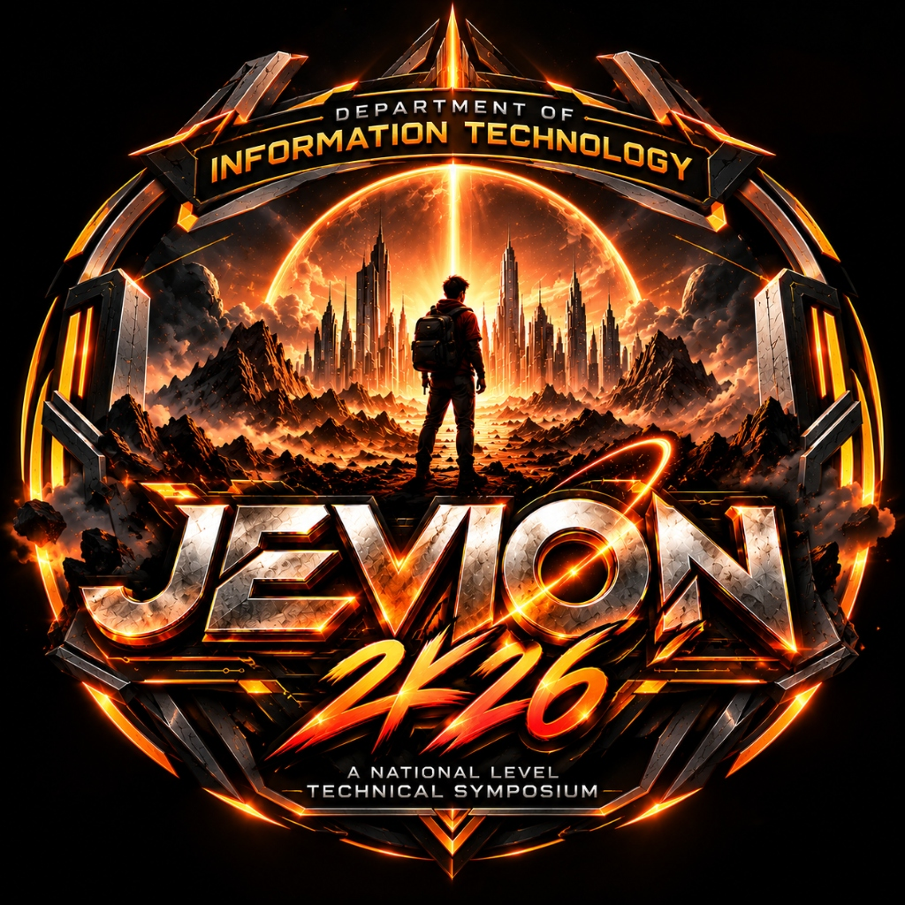

# JEVION 2K26 — National Level Technical Symposium



Official website for **JEVION 2K26**, a National Level Technical Symposium organized by the **Department of Information Technology**, **School of Engineering and Technology**, **Dhanalakshmi Srinivasan University** in association with **Tech Titans**.

## 📅 Event Dates
- **Day 1:** October 14, 2026
- **Day 2:** October 15, 2026

## 🏢 Venue
Lecture Theatre, 6th Floor, Academic Block

## 🎯 Events

### Day 1
**Technical:** Tech Talk (Paper Presentation), EraseX (Debugging)
**Non-Technical:** Titan 11 (IPL Auction), Insta Lens (Photography), Think & Link (Connection)

### Day 2
**Technical:** Code Hack (Mini Hackathon), Hunt IQ (Quiz)
**Non-Technical:** Aurora Films (Short Film), Nayakan (Guess the Movie), Secret Hunt (Treasure Hunt)

## 💰 Registration
₹200 per participant

## 🛠️ Tech Stack
- React 19 + TypeScript
- Vite 8
- Tailwind CSS v4
- Framer Motion
- Google Sheets (Backend)

## 🚀 Getting Started

```bash
# Install dependencies
npm install

# Start dev server
npm run dev

# Build for production
npm run build
```

## 📊 Google Sheets Backend
See [google-apps-script/README.md](google-apps-script/README.md) for setup instructions.

## 📞 Coordinators

**Faculty:**
- Mrs. M. Sheeba — +91 9944481587
- Mr. S. Sashikumar — +91 9629301892

**Student:**
- Vishva S — +91 9360729933
- Girivaran C — +91 8056306369
